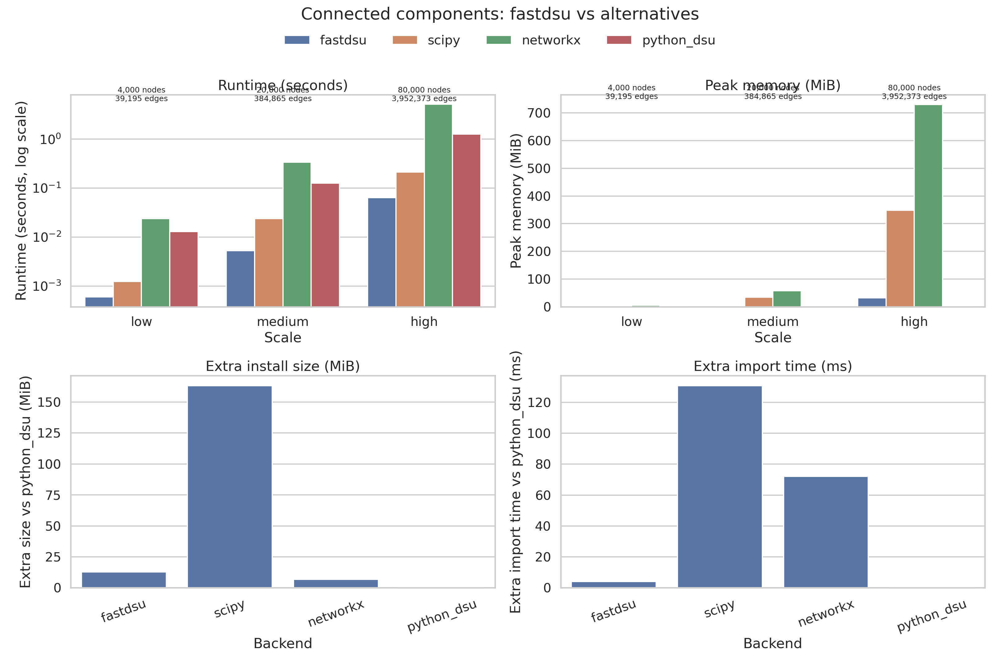

# ⚡️ Fast disjoint sets

A Python [disjoint sets](https://en.wikipedia.org/wiki/Disjoint-set_data_structure) implementation at Rust speed.

Supports buffer protocol-enabled types and Arrow C PyCapsule exporters for nodes and edges, such as NumPy arrays, `pyarrow.Array` (`__arrow_c_array__`), and `pyarrow.ChunkedArray` (`__arrow_c_stream__`), without either needing to be a dependency.

## Why another implementation?

If you need disjoint sets in Python you have a few options:

* A pure Python object
* SciPy's connected components
* A graph library, like networkx or rustworkx

We aim to be faster and more memory efficient that pure Python, while requiring fewer and smaller dependencies than SciPy or a graph library.

Other implementations typically allow you to work with any hashable type. We instead accept data via the buffer protocol and Arrow C Data PyCapsule interfaces, allowing zero-copy ingestion for minimal memory footprint, and disjoint set calculation over any compatible integer type. We also support any integer width, so you can further optimise memory use for your setting.

Other implementations can require building large objects unrelated to the core operation, such as a sparse matrix or a graph. By using the buffer protocol, we use significantly less memory, and do less work.

This is a highly performant disjoint set implementation made for production use cases.

The following benchmark is to convert a Polars edgelist to a polars Series of its components.



## Usage

Inputs can be provided through either:

* The Python buffer protocol.
* Arrow PyCapsule exporters: `__arrow_c_array__` and `__arrow_c_stream__`.

For Arrow inputs, nullable integer arrays are supported, but arrays containing actual null values are rejected.

### Stateless

Pure connected components. Works with any width of integer.

```python
import numpy as np
import polars as pl
import pyarrow as pa

from fastdsu import DSU, connected_components

# One-shot edge list in, labels out. Can use uint8 if we wish
src = pa.array([0, 1, 3, 4], type=pa.uint8())
dst = pa.array([1, 2, 4, 5], type=pa.uint8())
labels = connected_components(src, dst, num_nodes=6)
# labels: [0, 0, 0, 3, 3, 3]

# Chunked arrays (stream export) work too
chunked_src = pa.chunked_array([[0, 1], [3, 4]], type=pa.uint8())
chunked_dst = pa.chunked_array([[1, 2], [4, 5]], type=pa.uint8())
labels = connected_components(chunked_src, chunked_dst, num_nodes=6)

# Works with numpy too — anything supporting the buffer protocol
labels = connected_components(np.array([0, 1]), np.array([1, 2]))

# Works great with polars
edges = pl.DataFrame({"src": [0, 1, 3, 4], "dst": [1, 2, 4, 5]})
entities = edges.with_columns(
    component=pl.Series(
        connected_components(*edges.to_arrow(), num_nodes=6)
    )
)
```

### Stateful

When you want to pre-allocate memory or work incrementally.

```python
import pyarrow as pa
import numpy as np
from fastdsu import DSU, connected_components

# Pre-allocate memory
dsu = DSU(num_nodes=1_000_000)

# Feed edge batches as they arrive — zero-copy in
dsu.union(batch_1_src, batch_1_dst)
dsu.union(batch_2_src, batch_2_dst)

# Point queries
dsu.find(42)             # root of node 42
dsu.connected(42, 99)    # are they in the same component?

# Extract all labels as a buffer — zero-copy out
labels = dsu.labels()

# Convenience: get components as Python sets (materialises — use
# labels() + polars group_by for large data instead)
components = dsu.components()
# frozenset({frozenset({0, 1, 2}), frozenset({3, 4, 5}), ...})

# Reset and reuse the allocation for the next batch
dsu.reset()
```

### Arbitrary IDs

Though slower than with dense indices, we can work with arbitrary sparse IDs.

```python
# Node IDs don't need to be 0..N — use your actual entity IDs
nodes = pa.array([10, 25, 47, 99, 130, 200], type=pa.int64())

src = pa.array([10, 25, 130], type=pa.int64())
dst = pa.array([25, 47, 200], type=pa.int64())

# Stateless — pass nodes to declare the ID space
labels = connected_components(src, dst, nodes=nodes)
# labels: [10, 10, 10, 99, 130, 130]
```

## Contributing

This project is managed using [uv](https://docs.astral.sh/uv/), and our task runner is [just](https://just.systems/man/en/).

See all development tasks:

```sh
just
```
